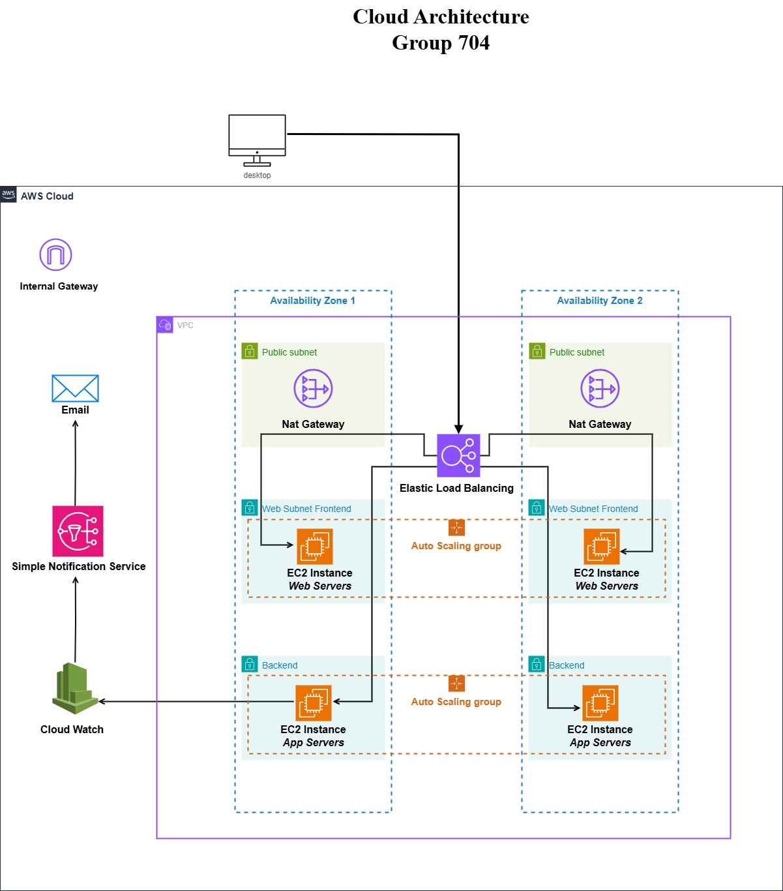

# Course Work: Cloud System Design and Evaluation
## Module: CO7219 Internet and Cloud Computing

### Group No: 704

#### Group Members:
| Name                  | Student ID |
|-----------------------|------------|
| Dhvanil Alpeshkumar Patel | dap36      |
| Parth Bharat B. Maru      | pbm5       |
| Anamika Ghosh            | ag711      |
| Abhishek U. More         | aum5       |

---

### Cloud Architecture:

